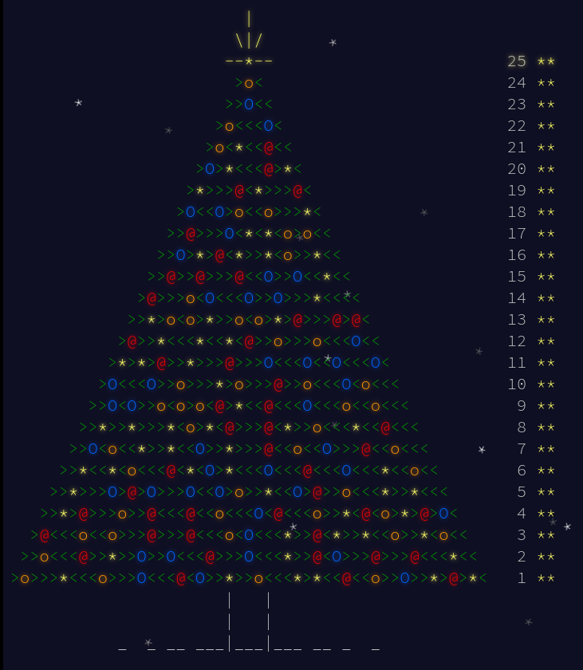

= Advent of Code 2015
:doctype: book
:toc:

image:https://godoc.org/gitlab.com/jhinrichsen/adventofcode2015?status.svg["godoc", link="https://godoc.org/gitlab.com/jhinrichsen/adventofcode2015"]
image:https://goreportcard.com/badge/gitlab.com/jhinrichsen/adventofcode2015["Go report card", link="https://goreportcard.com/report/gitlab.com/jhinrichsen/adventofcode2015"]
image:https://gitlab.com/jhinrichsen/adventofcode2015/badges/main/pipeline.svg[link="https://gitlab.com/jhinrichsen/adventofcode2015/-/commits/main",title="pipeline status"]
image:https://gitlab.com/jhinrichsen/adventofcode2015/badges/master/coverage.svg?style=flat["coverage", link="https://gitlab.com/jhinrichsen/adventofcode2015/-/jobs"]

This is an implementation of https://adventofcode.com/2015[Advent of Code 2015] in Rust (from day 1 through 7) and Go.

I reverted from Rust to Go because the instability of Rust made me lose all interest.
Which turned out to be a good decision.
Even in 2023 people use Rust's nightly when doing AOC 2023, and a feature flag list that spans multiple pages.

== Build from source

----
$ go get gitlab.com/jhinrichsen/adventofcode2015
----

== Benchmarks

Go 1.16.6, MacBook Pro 2019
----
go test -run=^$ -bench=. -benchmem -timeout=30m
goos: darwin
goarch: amd64
pkg: gitlab.com/jhinrichsen/adventofcode2015
cpu: Intel(R) Core(TM) i9-9980HK CPU @ 2.40GHz
BenchmarkDay1Part1-16              	  318814	      3435 ns/op	       0 B/op	       0 allocs/op
BenchmarkDay1Part1Branchless-16    	  269575	      3839 ns/op	       0 B/op	       0 allocs/op
BenchmarkDay1Part2-16              	 1447368	       797.7 ns/op	       0 B/op	       0 allocs/op
BenchmarkDay20Champ-16             	       4	 321160662 ns/op	28803072 B/op	       1 allocs/op
BenchmarkDay20MyChamp-16           	       4	 299910081 ns/op	28803072 B/op	       1 allocs/op
BenchmarkDay23Part1-16             	   11517	    100522 ns/op	   55696 B/op	    1486 allocs/op
BenchmarkDay25Part1-16             	      12	  86477669 ns/op	       0 B/op	       0 allocs/op
BenchmarkDay6Part1-16              	      24	  51590291 ns/op	   41376 B/op	     900 allocs/op
BenchmarkDay6Part2-16              	      18	  58150744 ns/op	   41376 B/op	     900 allocs/op
BenchmarkSigma-16                  	 4421583	       269.5 ns/op	       0 B/op	       0 allocs/op
BenchmarkYieldAlt-16               	396355009	         3.073 ns/op	       0 B/op	       0 allocs/op
BenchmarkSigmaRecursive-16         	    4809	    251532 ns/op	  203425 B/op	   10758 allocs/op
BenchmarkSigmaMemoized-16          	129887812	         9.233 ns/op	       0 B/op	       0 allocs/op
PASS
----

Go 1.22.2, Framework Laptop 16"
----
$ go test -run=xxx -bench=. -benchmem
goos: linux
goarch: amd64
pkg: gitlab.com/jhinrichsen/adventofcode2015
cpu: AMD Ryzen 7 7840HS w/ Radeon 780M Graphics
BenchmarkDay1Part1-16              	  365810	      3174 ns/op	       0 B/op	       0 allocs/op
BenchmarkDay1Part1Branchless-16    	  855054	      1406 ns/op	       0 B/op	       0 allocs/op
BenchmarkDay1Part2-16              	 1604402	       745.1 ns/op	       0 B/op	       0 allocs/op
BenchmarkDay20Champ-16             	       4	 300328312 ns/op	28803072 B/op	       1 allocs/op
BenchmarkDay20MyChamp-16           	       7	 158237253 ns/op	28803085 B/op	       1 allocs/op
BenchmarkDay23Part1-16             	   23416	     50221 ns/op	   55680 B/op	    1484 allocs/op
BenchmarkDay25Part1-16             	      12	  96354585 ns/op	       0 B/op	       0 allocs/op
BenchmarkDay6Part1-16              	      30	  34820575 ns/op	   41376 B/op	     900 allocs/op
BenchmarkDay6Part2-16              	      30	  35163435 ns/op	   41376 B/op	     900 allocs/op
BenchmarkSigma-16                  	 8152702	       145.2 ns/op	       0 B/op	       0 allocs/op
BenchmarkYieldAlt-16               	560823036	         2.132 ns/op	       0 B/op	       0 allocs/op
BenchmarkSigmaRecursive-16         	    9974	    119114 ns/op	  117360 B/op	    7824 allocs/op
BenchmarkSigmaMemoized-16          	194258068	         6.566 ns/op	       0 B/op	       0 allocs/op
PASS
ok  	gitlab.com/jhinrichsen/adventofcode2015	22.969s
----
