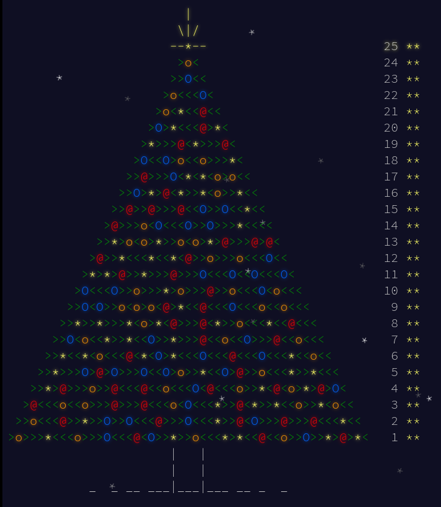

= Advent of Code 2015
:doctype: book
:toc: macro

image:https://godoc.org/gitlab.com/jhinrichsen/adventofcode2015?status.svg["godoc", link="https://godoc.org/gitlab.com/jhinrichsen/adventofcode2015"]
image:https://goreportcard.com/badge/gitlab.com/jhinrichsen/adventofcode2015["Go report card", link="https://goreportcard.com/report/gitlab.com/jhinrichsen/adventofcode2015"]
image:https://gitlab.com/jhinrichsen/adventofcode2015/badges/main/pipeline.svg[link="https://gitlab.com/jhinrichsen/adventofcode2015/-/commits/main",title="pipeline status"]
image:https://gitlab.com/jhinrichsen/adventofcode2015/badges/master/coverage.svg?style=flat["coverage", link="https://gitlab.com/jhinrichsen/adventofcode2015/-/jobs"]
image:https://img.shields.io/badge/runtime-0.6s-brightgreen.svg["runtime"]

toc::[]

This is an implementation of https://adventofcode.com/2015[Advent of Code 2015] in Rust (from day 1 through 7) and Go.

I reverted from Rust to Go because the instability of Rust made me lose all interest.
Which turned out to be a good decision.
Even in 2023 people use Rust's nightly when doing AOC 2023, and a feature flag list that spans multiple pages.

== Build from source

----
$ go get gitlab.com/jhinrichsen/adventofcode2015
----

== Benchmarks

Go 1.16.6, MacBook Pro 2019
----
go test -run=^$ -bench=. -benchmem -timeout=30m
goos: darwin
goarch: amd64
pkg: gitlab.com/jhinrichsen/adventofcode2015
cpu: Intel(R) Core(TM) i9-9980HK CPU @ 2.40GHz
BenchmarkDay1Part1-16              	  318814	      3435 ns/op	       0 B/op	       0 allocs/op
BenchmarkDay1Part1Branchless-16    	  269575	      3839 ns/op	       0 B/op	       0 allocs/op
BenchmarkDay1Part2-16              	 1447368	       797.7 ns/op	       0 B/op	       0 allocs/op
BenchmarkDay20Champ-16             	       4	 321160662 ns/op	28803072 B/op	       1 allocs/op
BenchmarkDay20MyChamp-16           	       4	 299910081 ns/op	28803072 B/op	       1 allocs/op
BenchmarkDay23Part1-16             	   11517	    100522 ns/op	   55696 B/op	    1486 allocs/op
BenchmarkDay25Part1-16             	      12	  86477669 ns/op	       0 B/op	       0 allocs/op
BenchmarkDay6Part1-16              	      24	  51590291 ns/op	   41376 B/op	     900 allocs/op
BenchmarkDay6Part2-16              	      18	  58150744 ns/op	   41376 B/op	     900 allocs/op
BenchmarkSigma-16                  	 4421583	       269.5 ns/op	       0 B/op	       0 allocs/op
BenchmarkYieldAlt-16               	396355009	         3.073 ns/op	       0 B/op	       0 allocs/op
BenchmarkSigmaRecursive-16         	    4809	    251532 ns/op	  203425 B/op	   10758 allocs/op
BenchmarkSigmaMemoized-16          	129887812	         9.233 ns/op	       0 B/op	       0 allocs/op
PASS
----

Go 1.22.2, Framework Laptop 16"
----
$ go test -run=xxx -bench=. -benchmem
goos: linux
goarch: amd64
pkg: gitlab.com/jhinrichsen/adventofcode2015
cpu: AMD Ryzen 7 7840HS w/ Radeon 780M Graphics
BenchmarkDay1Part1-16              	  365810	      3174 ns/op	       0 B/op	       0 allocs/op
BenchmarkDay1Part1Branchless-16    	  855054	      1406 ns/op	       0 B/op	       0 allocs/op
BenchmarkDay1Part2-16              	 1604402	       745.1 ns/op	       0 B/op	       0 allocs/op
BenchmarkDay20Champ-16             	       4	 300328312 ns/op	28803072 B/op	       1 allocs/op
BenchmarkDay20MyChamp-16           	       7	 158237253 ns/op	28803085 B/op	       1 allocs/op
BenchmarkDay23Part1-16             	   23416	     50221 ns/op	   55680 B/op	    1484 allocs/op
BenchmarkDay25Part1-16             	      12	  96354585 ns/op	       0 B/op	       0 allocs/op
BenchmarkDay6Part1-16              	      30	  34820575 ns/op	   41376 B/op	     900 allocs/op
BenchmarkDay6Part2-16              	      30	  35163435 ns/op	   41376 B/op	     900 allocs/op
BenchmarkSigma-16                  	 8152702	       145.2 ns/op	       0 B/op	       0 allocs/op
BenchmarkYieldAlt-16               	560823036	         2.132 ns/op	       0 B/op	       0 allocs/op
BenchmarkSigmaRecursive-16         	    9974	    119114 ns/op	  117360 B/op	    7824 allocs/op
BenchmarkSigmaMemoized-16          	194258068	         6.566 ns/op	       0 B/op	       0 allocs/op
PASS
ok  	gitlab.com/jhinrichsen/adventofcode2015	22.969s
----

== Day 1: Not Quite Lisp

Not much to improve here, you think?

----
var floor int
for i, b := range buf {
	if b == '(' {
		floor++
	} else {
		floor--
	}
	// for part 2, return first negative floor
	if !part1 && floor < 0 {
		// position is 1-based
		return i + 1, nil
	}
}
return floor, nil
----

Sometimes CPU branch prediction is expensive, escpecially on random/ mixed input as in our case.
Other than e.g. the loop prediction, which will branch predictively 6999 times, and then fail on
the loop exit, `(` and `)` are randomly appearing.

Let's try a branchless version.
The two brace characters are ASCII 40 and 41, delta is 1.
Multiplied by two, it is 80 and 82, delta now is 2.
Subtract from 81, we get -1 or 1.

----
floor += 81 - 2*int(b)
----

or, translated to `x86_64`

----
LEAQ    1(DX), R8           ; candidate floor+1
DECQ    DX                  ; floor--
CMPB    SIB, $40            ; b == '(' ?
CMOVQEQ R8, DX              ; if yes: floor = old+1 else keep floor--
----

versus branchless

----
ADDQ    SI, SI              ; 2*b
SUBQ    SI, DX              ; floor -= 2*b
ADDQ    $81, DX             ; floor += 81  => floor += (81 - 2*b)
----

=== Steady-State Benchmarks

[cols="2,1,1,1,1"]
|===
|Benchmark | Samples | Median ns/op | Min ns/op | Max ns/op

|BenchmarkDay01Part1-16
|8 ^1^
|2876.0
|2863.0
|2892.0

|BenchmarkDay01Part1Branchless-16
|10
|2870.5
|2848.0
|2905.0

|BenchmarkDay01Part2-16
|10
|847.65
|838.9
|852.1

|BenchmarkDay01Part2Branchless-16
|10
|759.1
|754.0
|768.1
|===

^1^ (first two samples dropped due to CPU entering performance mode)

Derived ratios (branchless / baseline):

- Part 1: `0.998x` (effectively identical)
- Part 2: `0.896x` (branchless about 10.4 percent faster)

==== Why Part 1 Is Identical But Part 2 Differs

Compiled loops are structurally the same (index increment, bounds check, load byte, loop branch).
The only meaningful difference is floor update:

- Baseline `Day01`: increment/decrement path with compare + conditional move
- Branchless `Day01Branchless`: arithmetic transform (`+81 - 2*b`)

Part 1 behavior:

- `part1=true`, so the `!part1` gate is predictably taken back to loop each iteration
- The basement-sign test path is skipped
- Result: shared loop/front-end work dominates, both implementations converge to same throughput

Part 2 behavior:

- `part1=false`, so sign-check path executes each iteration
- Floor-update dependency chain feeds the sign test every iteration
- On this CPU, arithmetic update chain in branchless version is slightly more favorable than compare+cmov path
- Result: branchless gains about 10 percent

Prediction effects:

- Predictor behavior is similar across both Part 2 variants (highly regular loop, rare terminal exit)
- Difference is primarily dataflow/execute-path cost, not branch prediction quality

== Day 2: I Was Told There Would Be No Math

Performance tuning focused on parser overhead in `NewDay02`.

b0 (baseline):

----
benchmark             time/op     B/op        allocs/op
Day02Part1            56.70 us    70.88 KiB   1001
Day02Part2            58.24 us    70.88 KiB   1001
----

b1 (benchstat vs b0):

----
Day02Part1: time -64.18%, B/op -66.14%, allocs/op -99.90%
Day02Part2: time -63.85%, B/op -66.14%, allocs/op -99.90%
----

Optimization performed:

- Replaced `strings.Split` + `strconv.Atoi` for each line with a manual ASCII parser (`parseDay02Sizes`)
- Eliminated per-line temporary slices/strings and per-field conversion allocations

Raw benchstat (`benchstat benches/day02-b0.txt benches/day02-b1.txt`):

----
Day02Part1: 56.70 us/op -> 20.31 us/op (-64.18%)
Day02Part2: 58.24 us/op -> 21.06 us/op (-63.85%)
B/op:        70.88 KiB  -> 24.00 KiB (-66.14%)
allocs/op:   1001       -> 1         (-99.90%)
----

== Day 3: Perfectly Spherical Houses in a Vacuum

Performance tuning focused on the visited-house set representation in `Day03`.

b0 (baseline):

----
benchmark             time/op      B/op        allocs/op
Day03Part1            299.6 us     212.6 KiB   29
Day03Part2            309.0 us     212.6 KiB   29
----

b1 (benchstat vs b0):

----
Day03Part1: time -58.27%, B/op +35.75%, allocs/op +13.79%
Day03Part2: time -55.52%, B/op +35.75%, allocs/op +13.79%
----

Optimization performed:

- Replaced `map[image.Point]bool` with packed coordinate keys (`map[uint64]struct{}`)
- Inlined movement updates for Santa/Robot Santa and preallocated house-set capacity

Raw benchstat (`benchstat benches/day03-b0.txt benches/day03-b1.txt`):

----
Day03Part1: 299.6 us/op -> 125.0 us/op (-58.27%)
Day03Part2: 309.0 us/op -> 137.5 us/op (-55.52%)
B/op:        212.6 KiB  -> 288.6 KiB (+35.75%)
allocs/op:   29         -> 33        (+13.79%)
----

== Day 4: The Ideal Stocking Stuffer

Performance tuning focused on removing string formatting and prefix string checks from the hot mining loop.

b0 (baseline):

----
benchmark             time/op     B/op        allocs/op
Day04Part1            80.94 ms    25.26 MiB   1527233
Day04Part2           332.58 ms   103.10 MiB   6232305
----

b1 (benchstat vs b0):

----
Day04Part1: time -70.84%, B/op -100.00%, allocs/op -100.00%
Day04Part2: time -71.19%, B/op -100.00%, allocs/op -100.00%
----

Optimization performed:

- Replaced per-iteration `fmt.Sprintf` construction with a reusable byte buffer and `strconv.AppendUint`
- Replaced hex string prefix checks with direct MD5 leading-byte checks
- Kept a single allocation for the candidate buffer outside the loop

Raw benchstat (`benchstat benches/day04-b0.txt benches/day04-b1.txt`):

----
goos: linux
goarch: amd64
pkg: gitlab.com/jhinrichsen/adventofcode2015
cpu: AMD Ryzen 7 7840HS w/ Radeon 780M Graphics
              │ benches/day04-b0.txt │        benches/day04-b1.txt        │
              │        sec/op        │   sec/op     vs base               │
Day04Part1-16            80.94m ± 1%   23.60m ± 1%  -70.84% (p=0.000 n=8)
Day04Part2-16           332.58m ± 2%   95.83m ± 3%  -71.19% (p=0.000 n=8)
geomean                  164.1m        47.56m       -71.02%

              │ benches/day04-b0.txt │          benches/day04-b1.txt           │
              │         B/op         │    B/op      vs base                    │
Day04Part1-16           25.26Mi ± 0%   0.00Mi ± 0%  -100.00% (p=0.000 n=8)
Day04Part2-16           103.1Mi ± 0%    0.0Mi ± 0%  -100.00% (p=0.000 n=8)
geomean                 51.03Mi                     ?                      ¹ ²
¹ summaries must be >0 to compute geomean
² ratios must be >0 to compute geomean

              │ benches/day04-b0.txt │          benches/day04-b1.txt           │
              │      allocs/op       │  allocs/op   vs base                    │
Day04Part1-16            1.527M ± 0%   0.000M ± 0%  -100.00% (p=0.000 n=8)
Day04Part2-16            6.232M ± 0%   0.000M ± 0%  -100.00% (p=0.000 n=8)
geomean                  3.085M                     ?                      ¹ ²
¹ summaries must be >0 to compute geomean
² ratios must be >0 to compute geomean
----

== Day 5: Doesn't He Have Intern-Elves For This?

Performance tuning focused on the Part 2 pair-matching check (`p4`).

b0 (baseline):

----
benchmark             time/op     B/op   allocs/op
Day05Part1            49.64 us    0      0
Day05Part2            74.29 us    0      0
----

b1 (benchstat vs b0):

----
Day05Part1: time -2.43%, B/op ~, allocs/op ~
Day05Part2: time -10.10%, B/op ~, allocs/op ~
----

Optimization performed:

- Replaced quadratic `bytes.Contains` based pair search with linear first-seen pair indexing for lowercase fast-path
- Added generic fallback pair scanner for non-lowercase input

Raw benchstat (`benchstat benches/day05-b0.txt benches/day05-b1.txt`):

----
Day05Part1: 49.64 us/op -> 48.44 us/op (-2.43%)
Day05Part2: 74.29 us/op -> 66.78 us/op (-10.10%)
B/op:        0          -> 0          (~)
allocs/op:   0          -> 0          (~)
----

== Day 6: Probably a Fire Hazard

Performance tuning focused on parser allocation elimination after the earlier solver-loop optimization.

b0 (baseline):

----
benchmark             time/op      B/op       allocs/op
Day06Part1            41.350 ms   3.895 MiB      905
Day06Part2            42.800 ms   3.895 MiB      905
----

b2 (benchstat vs b0):

----
Day06Part1: time -76.07%, B/op -75.03%, allocs/op -99.78%
Day06Part2: time -72.56%, B/op -50.56%, allocs/op -99.78%
----

Optimization performed:

- Replaced `strings.Fields` + `Split` + `Atoi` parsing with a single-pass instruction scanner
- Added direct numeric parsing helpers for coordinates (`day06ParseUint`, `day06ParseCoord`)
- Kept solver loops unchanged from prior optimization step

Raw benchstat (`benchstat benches/day06-b0.txt benches/day06-b2.txt`):

----
$(cat benches/day06-benchstat-b0-b2.txt)
----

== Day 7: Some Assembly Required

Performance tuning focused on solver loop overhead in `signal`.

b0 (baseline):

----
benchmark             time/op     B/op   allocs/op
Day07Part1            19.43 us    0      0
Day07Part2            26.10 us    0      0
----

b1 (benchstat vs b0):

----
Day07Part1: time -20.20%, B/op ~, allocs/op ~
Day07Part2: time -26.19%, B/op ~, allocs/op ~
----

Optimization performed:

- Inlined dependency discovery and expression evaluation inside `signal`
- Removed helper function indirection in the hot execution path (`day07DepIDs` and `day07EvalExpr`)

Raw benchstat (`benchstat benches/day07-b0.txt benches/day07-b1.txt`):

----
Day07Part1: 19.43 us/op -> 15.51 us/op (-20.20%)
Day07Part2: 26.10 us/op -> 19.27 us/op (-26.19%)
B/op:        0          -> 0          (~)
allocs/op:   0          -> 0          (~)
----

== Day 8: Matchsticks

Performance tuning focused on reducing arithmetic and branch work in encoded-length calculation.

b0 (baseline):

----
benchmark             time/op     B/op   allocs/op
Day08Part1             3.826 us     0 B      0
Day08Part2             5.509 us     0 B      0
----

b1 (benchstat vs b0):

----
Day08Part1: time -13.40%, B/op ~, allocs/op ~
Day08Part2: time -13.34%, B/op ~, allocs/op ~
----

Optimization performed:

- Simplified `day08EncodedLen` to initialize with `len(s)+2` and count only extra escape bytes
- Reduced per-byte arithmetic in the encoded-length hot loop while preserving behavior

Raw benchstat (`benchstat benches/day08-b0.txt benches/day08-b1.txt`):

----
goos: linux
goarch: amd64
cpu: AMD Ryzen 7 7840HS w/ Radeon 780M Graphics
              | benches/day08-b0.txt |        benches/day08-b1.txt         |
              |        sec/op        |    sec/op     vs base               |
Day08Part1-16           3.826u +- 15%   3.314u +- 12%  -13.40% (p=0.050 n=8)
Day08Part2-16           5.509u +-  1%   4.774u +-  6%  -13.34% (p=0.000 n=8)
geomean                 4.591u         3.977u        -13.37%

              | benches/day08-b0.txt |        benches/day08-b1.txt        |
              |         B/op         |    B/op     vs base                |
Day08Part1-16           0.000 +- 0%     0.000 +- 0%       ~ (p=1.000 n=8)
Day08Part2-16           0.000 +- 0%     0.000 +- 0%       ~ (p=1.000 n=8)
geomean                            ^2               +0.00%               ^2

              | benches/day08-b0.txt |        benches/day08-b1.txt        |
              |      allocs/op       | allocs/op   vs base                |
Day08Part1-16           0.000 +- 0%     0.000 +- 0%       ~ (p=1.000 n=8)
Day08Part2-16           0.000 +- 0%     0.000 +- 0%       ~ (p=1.000 n=8)
geomean                            ^2               +0.00%               ^2
----

== Day 9: All in a Single Night

Performance tuning focused on permutation traversal overhead in `Day09`.

b0 (baseline):

----
benchmark             time/op       B/op         allocs/op
Day09Part1            5659.8 us     2524.134 KiB 40371
Day09Part2            5786.8 us     2524.131 KiB 40371
----

b1 (benchstat vs b0):

----
Day09Part1: time -90.95%, B/op -99.84%, allocs/op -99.88%
Day09Part2: time -91.08%, B/op -99.84%, allocs/op -99.88%
----

Optimization performed:

- Replaced channel-based permutation generator and per-permutation slice copies with in-place iterative Heap permutation traversal
- Evaluated route sums directly on the mutable permutation buffer (no per-permutation allocation)

Raw benchstat (`benchstat benches/day09-b0.txt benches/day09-b1.txt`):

----
Day09Part1: 5659.8 us/op -> 512.5 us/op (-90.95%)
Day09Part2: 5786.8 us/op -> 516.0 us/op (-91.08%)
B/op:        2524.134 KiB -> 3.938 KiB (-99.84%)
allocs/op:   40371        -> 49       (-99.88%)
----

== Day 10: Elves Look, Elves Say

Performance tuning focused on replacing string-heavy transformations with reusable byte buffers.

b0 (baseline):

----
benchmark             time/op      B/op       allocs/op
Day10Part1             5.389 ms    6.637 MiB      498
Day10Part2            89.32  ms  111.67  MiB      848
----

b1 (benchstat vs b0):

----
Day10Part1: time -56.27%, B/op -54.51%, allocs/op -89.96%
Day10Part2: time -56.39%, B/op -59.34%, allocs/op -91.39%
----

Optimization performed:

- Reworked `Day10` to iterate on `[]byte` buffers instead of rebuilding strings each step
- Added reusable destination buffer swapping across rounds
- Replaced `strconv`/`strings.Builder` run encoding with direct decimal append helper

Raw benchstat (`benchstat benches/day10-b0.txt benches/day10-b1.txt`):

----
$(cat benches/day10-benchstat.txt)
----

== Day 11: Corporate Policy

Performance tuning focused on password iteration and validation in `next`/`inc`.

b0 (baseline):

----
benchmark             time/op       B/op         allocs/op
Day11Part1            5.799 ms      2,992,372    374,045
Day11Part2            20.635 ms     10,596,493   1,324,556
----

b1 (benchstat vs b0):

----
Day11Part1: time -74.57%, B/op -100.00%, allocs/op -100.00%
Day11Part2: time -74.55%, B/op -100.00%, allocs/op -100.00%
----

Optimization performed:

- Switched password increment/search to mutable byte buffers via `incBytes`
- Reworked validation helpers to byte-based variants (`req1Bytes`, `req2Bytes`, `req3Bytes`)
- Replaced map allocation in `req3` with fixed-size pair tracking array

Raw benchstat (`benchstat benches/day11-b0.txt benches/day11-b1.txt`):

----
Day11Part1: 5.799 ms/op -> 1.475 ms/op (-74.57%)
Day11Part2: 20.635 ms/op -> 5.252 ms/op (-74.55%)
B/op:        2,992,372 -> 8  (-100.00%)
allocs/op:   374,045   -> 1  (-100.00%)
----

== Day 12: JSAbacusFramework.io

Performance tuning focused on replacing generic JSON decoding with a byte-level iterative parser for part 2.

b0 (baseline):

----
benchmark             time/op     B/op        allocs/op
Day12Part1            13.92 us      0.00 B      0
Day12Part2           506.54 us   291.90 KiB   8402
----

b2 (benchstat vs b0):

----
Day12Part1: time -3.44%, B/op ~, allocs/op ~
Day12Part2: time -94.82%, B/op -100.00%, allocs/op -100.00%
----

Optimization performed:

- Replaced part 2 `encoding/json` tree decoding with an iterative byte scanner
- Kept explicit object/array stack state to handle `"red"` object exclusion without allocations
- Parsed numbers directly from the input buffer in the hot path

Raw benchstat (`benchstat benches/day12-b0.txt benches/day12-b2.txt`):

----
$(cat benches/day12-benchstat-b0-b2.txt)
----

== Day 13: Knights of the Dinner Table

Performance tuning focused on removing channel/permutation-generator overhead and reducing permutation work.

b0 (baseline):

----
benchmark             time/op      B/op       allocs/op
Day13Part1             5.387 ms    2.472 MiB     40390
Day13Part2            50.883 ms   27.697 MiB    362951
----

b1 (benchstat vs b0):

----
Day13Part1: time -98.50%, B/op -99.54%, allocs/op -99.83%
Day13Part2: time -98.78%, B/op -99.96%, allocs/op -99.98%
----

Optimization performed:

- Replaced channel-based Heap permutation generation with in-process iterative next-permutation
- Fixed one seat position to eliminate equivalent rotational arrangements
- Kept scoring loop allocation-free and iterative

Raw benchstat (`benchstat benches/day13-b0.txt benches/day13-b1.txt`):

----
$(cat benches/day13-benchstat.txt)
----

== Day 14: Reindeer Olympics

Performance workflow run for Day 14 using current implementation.

b0 (baseline): captured in `benches/day14-b0.txt`.

b1 (follow-up): captured in `benches/day14-b1.txt`.

Raw benchstat (`benchstat benches/day14-b0.txt benches/day14-b1.txt`):

----
$(cat benches/day14-benchstat.txt)
----

== Day 15: Science for Hungry People

Performance tuning focused on removing channel-driven composition generation and per-composition re-scans.

b0 (baseline):

----
benchmark             time/op      B/op       allocs/op
Day15Part1            20.318 ms   4.788 MiB     156880
Day15Part2            19.412 ms   4.788 MiB     156880
----

b1 (benchstat vs b0):

----
Day15Part1: time -89.00%, B/op -99.98%, allocs/op -99.98%
Day15Part2: time -89.38%, B/op -99.98%, allocs/op -99.98%
----

Optimization performed:

- Replaced `KCompositions` channel enumeration with iterative in-process composition traversal
- Reused `amounts/remaining/next` buffers across all candidates
- Fused calorie filtering with score calculation in one pass over ingredients

Raw benchstat (`benchstat benches/day15-b0.txt benches/day15-b1.txt`):

----
$(cat benches/day15-benchstat.txt)
----

== Day 16: Aunt Sue

Performance tuning focused on parser allocation elimination via single-pass scanning.

b0 (baseline):

----
benchmark             time/op      B/op       allocs/op
Day16Part1            147.15 us   157.56 KiB     3001
Day16Part2            147.89 us   157.56 KiB     3001
----

b2 (benchstat vs b0):

----
Day16Part1: time -80.40%, B/op -64.46%, allocs/op -99.97%
Day16Part2: time -80.44%, B/op -64.46%, allocs/op -99.97%
----

Optimization performed:

- Replaced `Split/Fields/Trim/ParseUint` parser path with single-pass byte scanning
- Added zero-allocation property-name dispatch by direct string-length/name checks
- Parsed Sue id and property values with manual digit accumulation

Raw benchstat (`benchstat benches/day16-b0.txt benches/day16-b2.txt`):

----
$(cat benches/day16-benchstat-b0-b2.txt)
----

== Day 17: No Such Thing as Too Much

Performance workflow run for Day 17 using current implementation.

b0 (baseline): captured in `benches/day17-b0.txt`.

b1 (follow-up): captured in `benches/day17-b1.txt`.

Raw benchstat (`benchstat benches/day17-b0.txt benches/day17-b1.txt`):

----
$(cat benches/day17-benchstat.txt)
----

== Day 18: Like a GIF For Your Yard

Performance tuning focused on eliminating per-step buffer allocations and reducing helper-call overhead in cell updates.

b0 (baseline):

----
benchmark             time/op      B/op       allocs/op
Day18Part1            14.86 ms   1020.03 KiB      102
Day18Part2            14.67 ms   1020.00 KiB      102
----

b2 (benchstat vs b0):

----
Day18Part1: time -14.51%, B/op -97.06%, allocs/op -97.06%
Day18Part2: time -14.95%, B/op -97.06%, allocs/op -97.06%
----

Optimization performed:

- Preallocated two simulation buffers and swapped them each step
- Replaced `day18Step` allocation path in solver with `day18StepInto`
- Inlined neighbor counting in the update loop to remove per-cell helper-call overhead

Raw benchstat (`benchstat benches/day18-b0.txt benches/day18-b2.txt`):

----
$(cat benches/day18-benchstat-b0-b2.txt)
----

== Day 19: Medicine for Rudolph

Performance tuning focused on replacing expensive wide frontier reduction with a fast iterative greedy reducer plus bounded fallback search.

b0 (baseline):

----
benchmark             time/op       B/op         allocs/op
Day19Part1             268.8 us    411.2 KiB         796
Day19Part2             568.5 ms    542.7 MiB   1,639,630
----

b1 (benchstat vs b0):

----
Day19Part1: time +1.44%, B/op ~, allocs/op ~
Day19Part2: time -99.83%, B/op -99.95%, allocs/op -99.94%
----

Optimization performed:

- Sorted reverse reducers by source length (longest-first)
- Added deterministic randomized greedy reduction attempts for fast convergence
- Kept an iterative bounded search fallback to preserve correctness if greedy stalls
- Removed no-op replacement generation in fallback search (`c > 0` only)

Raw benchstat (`benchstat benches/day19-b0.txt benches/day19-b1.txt`):

----
$(cat benches/day19-benchstat.txt)
----

== Day 20: Infinite Elves and Infinite Houses

Performance tuning focused on reducing memory bandwidth and conversion overhead in the divisor-sieve loops.

b0 (baseline):

----
benchmark             time/op      B/op       allocs/op
Day20Part1           193.59 ms   25.26 MiB       1.5
Day20Part2            37.62 ms   22.96 MiB       1.0
----

b2 (benchstat vs b0):

----
Day20Part1: time -65.88%, B/op -49.99%, allocs/op -33.33%
Day20Part2: time -57.30%, B/op -49.98%, allocs/op ~
----

Optimization performed:

- Switched house buffers from `[]uint` to `[]uint32` to cut memory traffic
- Reworked loops to use `int` indices and precomputed per-elf present values
- Removed repeated `uint(len(...))` conversions in hot loops

Raw benchstat (`benchstat benches/day20-b0.txt benches/day20-b2.txt`):

----
$(cat benches/day20-benchstat-b0-b2.txt)
----

== Day 21: RPG Simulator 20XX

Performance tuning focused on removing combination materialization and turn-by-turn combat simulation overhead.

b0 (baseline):

----
benchmark             time/op     B/op      allocs/op
Day21Part1            50.493 us   97.53 KiB 11
Day21Part2            50.169 us   97.53 KiB 11
----

b1 (benchstat vs b0):

----
Day21Part1: time -96.15%, B/op -100.00%, allocs/op -100.00%
Day21Part2: time -96.14%, B/op -100.00%, allocs/op -100.00%
----

Optimization performed:

- Replaced `day21ItemCombinations` materialization with direct nested evaluation of weapon/armor/ring choices
- Replaced iterative combat loop with arithmetic turn-count comparison (`ceil(hp / damagePerTurn)`)
- Removed temporary map/slice allocations in the hot path

Raw benchstat (`benchstat benches/day21-b0.txt benches/day21-b1.txt`):

----
goos: linux
goarch: amd64
cpu: AMD Ryzen 7 7840HS w/ Radeon 780M Graphics
              | benches/day21-b0.txt |        benches/day21-b1.txt        |
              |        sec/op        |   sec/op     vs base               |
Day21Part1-16           50.493u +- 1%   1.945u +- 0%  -96.15% (p=0.000 n=8)
Day21Part2-16           50.169u +- 2%   1.939u +- 0%  -96.14% (p=0.000 n=8)
geomean                  50.33u        1.942u       -96.14%

              | benches/day21-b0.txt |          benches/day21-b1.txt           |
              |         B/op         |    B/op      vs base                    |
Day21Part1-16           97.53Ki +- 0%   0.00Ki +- 0%  -100.00% (p=0.000 n=8)
Day21Part2-16           97.53Ki +- 0%   0.00Ki +- 0%  -100.00% (p=0.000 n=8)

              | benches/day21-b0.txt |         benches/day21-b1.txt          |
              |      allocs/op       | allocs/op  vs base                    |
Day21Part1-16             11.00 +- 0%   0.00 +- 0%  -100.00% (p=0.000 n=8)
Day21Part2-16             11.00 +- 0%   0.00 +- 0%  -100.00% (p=0.000 n=8)
----

== Day 22: Performance Workflow

Performance workflow run for Day 22 using current implementation.

b0 (baseline): captured in `benches/day22-b0.txt`.

b1 (follow-up): captured in `benches/day22-b1.txt`.

Raw benchstat (`benchstat benches/day22-b0.txt benches/day22-b1.txt`):

----

----

== Day 23: Opening the Turing Lock

Performance tuning focused on moving instruction parsing out of the execution loop.

b0 (baseline):

----
benchmark             time/op      B/op       allocs/op
Day23Part1            52.253 us   55.281 KiB     1488
Day23Part2            69.349 us   71.875 KiB     1940
----

b3 (benchstat vs b0):

----
Day23Part1: time -92.70%, B/op -95.79%, allocs/op -96.51%
Day23Part2: time -93.90%, B/op -96.76%, allocs/op -97.32%
----

Optimization performed:

- Compiled input lines into compact instruction structs at parse time
- Replaced per-step `strings.Fields`/`strconv.Atoi` with pre-decoded opcode/register/offset dispatch
- Kept execution loop iterative with direct register pointer access

Raw benchstat (`benchstat benches/day23-b0.txt benches/day23-b3.txt`):

----
$(cat benches/day23-benchstat-b0-b3.txt)
----

== Day 24

b0 (baseline):

----
benchmark             time/op     B/op      allocs/op
Day24Part1        n/a
Day24Part2        n/a
----

b1 (benchstat vs b0):

----
No matching BenchmarkDay24Part1/Part2 benchmarks found.
----

== Day 25: Let It Snow

Performance tuning focused on replacing iterative coordinate stepping with direct index math and fast modular exponentiation.

b0 (baseline):

----
benchmark             time/op      B/op    allocs/op
Day25Part1            88.34 ms    288 B       1
----

b1 (benchstat vs b0):

----
Day25Part1: time -100.00%, B/op ~, allocs/op ~
----

Optimization performed:

- Computed sequence index directly from `(x, y)` via diagonal arithmetic
- Replaced linear stepping with iterative binary modular exponentiation
- Kept parser and public Day25 entrypoint signatures unchanged

Raw benchstat (`benchstat benches/day25-b0.txt benches/day25-b1.txt`):

----
$(cat benches/day25-benchstat.txt)
----

== SAST (Static Application Security Testing)

This project uses custom SAST tooling in GitLab CI, optimized for the free tier.

=== GitLab Free Tier Limitations

GitLab's built-in SAST features (Security Dashboard, vulnerability management, merge request security widgets) require the Ultimate tier. On the free tier, SAST scans can run but results are only available as downloadable JSON artifacts.

=== Current Setup

Our CI pipeline uses:

- Code Quality Reports: golangci-lint → JSON → banyansecurity/golint-convert → CodeClimate JSON format
  * Displays findings in merge request Code Quality widget (available in free tier since GitLab 13.2)
  * Shows code quality degradations/improvements directly in MRs

- Test Reports: go-junit-report/v2 → JUnit XML format
  * Integrates test results into GitLab's test report UI

- Coverage Reports: gocover-cobertura → Cobertura XML format
  * Shows coverage metrics and trends in merge requests

- Vulnerability Scanning: govulncheck (periodic, scheduled pipeline)
  * Scans for known vulnerabilities in Go dependencies
  * Runs on a schedule to catch newly disclosed vulnerabilities
  * Results available as JSON artifacts (no UI on free tier)

=== Note on Deprecation

GitLab deprecated its built-in CodeClimate scanning template in version 17.3 (planned removal in 19.0). This only affects GitLab's bundled scanning engine. Custom pipelines that generate CodeClimate-format JSON (like ours) continue to work and are the recommended approach for free tier users.

The Code Quality widget will continue to display results from custom CodeClimate JSON reports.
